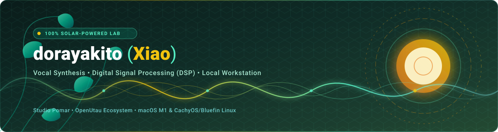

  

   

  [+%26+Linux)](https://git.io/typing-svg)

  

    <strong>Desenvolvedor de Software focado em Síntese Vocal, Processamento Digital de Sinais (DSP) e ferramentas Open Source.</strong>
  

  

    
    
    
    
    
  

---

### Sobre Mim

- **Especialista no ecossistema Vocal Synth**: desenvolvimento de resamplers, phonemizers e DAWs baseadas em OpenUtau, UTAU e DiffSinger.
- **DSP e Áudio de Baixo Nível**: processamento de magnitudes FFT, resamplers em C++ e Rust e algoritmos neurais de voz.
- **Ambientes e Compatibilidade**: macOS (Apple Silicon / M1) e Linux (CachyOS, Bluefin) como sistemas principais, com ampla experiência em desenvolvimento multiplataforma e compatibilidade no Windows.
- **Workflow e Filosofia**: foco em código estruturado e engenharia determinística (não adepto de vibe coding). Para consultas de erros, análise e debug, utilizo modelos de IA locais rodando diretamente no MacBook Pro M1.
- **Sustentabilidade**: ambiente doméstico e estação de desenvolvimento alimentados por energia solar.
- **Contribuições Globais**: criação de padrões fonéticos multilinguais (Português Brasileiro e Mandarim Padrão).

---

### Tech Stack e Tecnologias

#### Linguagens de Programação

  
  
  
  
  

#### Síntese Vocal, DSP e Áudio

  
  
  
  

#### Ambiente e Sistemas Operacionais

  
  
  
  
  
  

---

### Projetos em Destaque

| Projeto | Descrição | Stack |
| :--- | :--- | :--- |
| **[Kamafeu](https://github.com/studiopomar/kamafeu)** | Editor e sintetizador vocal moderno em Rust compatível com UTAU, OpenUtau e oto.ini. Piano roll multifaixa e motor DSP nativo (TD-PSOLA). | `Rust` `DSP/TD-PSOLA` `egui` |
| **[Copaiba NEO](https://studiopomar.github.io/Copaiba-NEO/)** | Suíte interativa de análise espectral e computação de magnitudes FFT em tempo real para áudio e síntese vocal. | `Rust` `Wasm` `WebAudio` `DSP` |
| **[Resonata-Studio](https://github.com/dorayakito/Resonata-Studio)** | Workstation / DAW moderna para cantores virtuais baseada em OpenUtau, DiffSinger e conversão de voz via IA. | `C#` `OpenUtau` `AI/DiffSinger` |
| **[Phonemizers-PTBR](https://github.com/dorayakito/Phonemizers-PTBR)** | Suíte pública de phonemizers multilinguais para o OpenUtau (suporte a PT-BR). | `C#` `G2P` `OpenUtau` |
| **[VCCX-PT-BR](https://github.com/dorayakito/VCCX-PT-BR)** | Sistema fonético e framework com +739 amostras e documentação para voicebanks naturais no UTAU / OpenUtau. | `Phonetics` `Oto.ini` `UTAU` |
| **[lessampler-ng](https://github.com/dorayakito/lessampler-ng)** | Singing Voice Resampler e sintetizador de alta performance. | `C++` `DSP` `Audio` |

---

### Estatísticas do GitHub

  
  

  

---

  Desenvolvimento focado em síntese de voz e código aberto.

